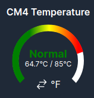
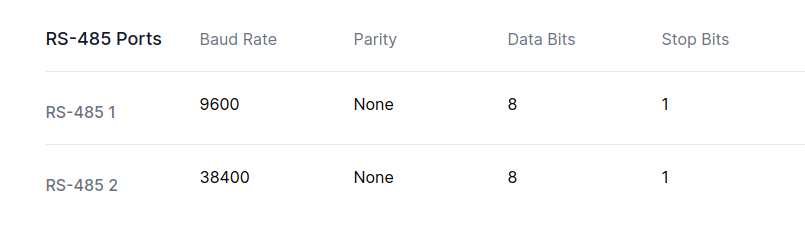

# Latest Release Candidate: [MDI 1.0.3-PR1](https://github.com/Altronic-LLC/Altronic-Public-Files/blob/main/ACM4000_Releases/MDI_1.0.2-RC/mdi-1.0.3-PR1.atf)
**Important:**  
**If you're installing this on a system running a version earlier than 1.0.2-RC1, please rename the file to `mdi-1.0.2.atf`. This ensures the system will recognize the update file. This naming issue has been resolved in this release.**

### Changelog:

#### Fixes:
- **AWI Reupload:** Fixed an issue when reuploading an AWI device registers would not update if the registers changed until a reboot.

#### Quality of Life (QOL) Improvements:
- **CM4:** Added Datalogging for CM4 Temperature, CPU Usage, CPU Clock, and System Ram.
- **Temperature:** Added Graphic for CM4 Temperature this will show you the current temperature in C or F.  
    
- **RTU:** Added the ability to set Parity, Data Bits, and Stop Bits for RS-485 Ports.  
    
- **RTU:** Set Defaults to baud rates for RS-485 1 at 9600 baud and RS-485 2 at 38400 baud instead of empty selections.
- **QOL-GENERAL:** Removed non-required browser console logging.
- **Gateway Caching:** Changed Cache time from 500ms to 1s to speed up networking when using multiple browsers. 
- **Main Device:** Added none option for Main Device.