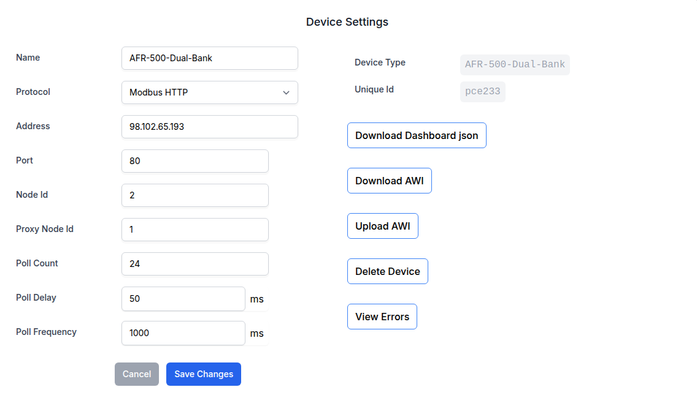
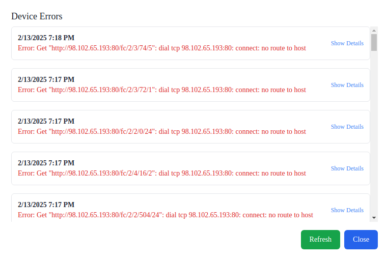

# [MDI 1.1.2-PR](https://github.com/Altronic-LLC/Altronic-Public-Files/blob/main/ACM4000_Releases/PR/1.1.2/mdi-1.1.2-PR.atf)

### Changelog:

#### Quality of Life Changes:
- **Screen Sleep Timer:** Added the ability to ignore the first input when pressing the screen, for this to take effect re-save the screen sleep timer.

#### Bug Fixes:
- **Main Device:** Fixed an issue in 1.1.1 where when selecting an AWI as the main device, this did not show properly.

#### New Feature:
- **Device Poll Errors:** Added an option to view communication errors for each device up to the last 50 available.
- **Device Poll Errors Location:** 

- **Device Poll Errors Example:** 
